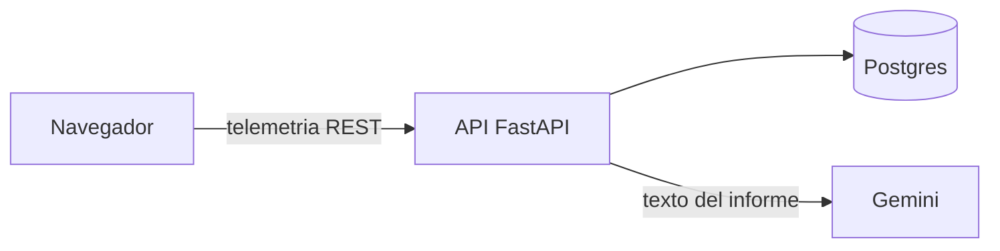

# GuitarCoach Backend

API FastAPI de GuitarCoach AI. El audio no llega a este servicio: el cliente envía telemetría.

## Cómo ejecutarlo

Requisitos: Python 3.12.

```powershell
python -m venv .venv
.\.venv\Scripts\python.exe -m pip install -e ".[dev]"
.\.venv\Scripts\python.exe -m ruff check app tests
.\.venv\Scripts\python.exe -m ruff format --check app tests
.\.venv\Scripts\python.exe -m mypy
.\.venv\Scripts\python.exe -m pytest
.\.venv\Scripts\python.exe -m uvicorn app.main:app --reload --port 8000
```

`GET /health` responde `{"status": "ok"}`.

El cliente envía `POST /attempts` con la telemetría ya juzgada en el navegador. `POST /attempts/{id}/report` pide el informe y `GET /me/progress` devuelve la precisión de los intentos. `POST /songs/import` responde 202 y el estado se consulta en `GET /jobs/{id}`.



La variante de capa gratuita usa Neon o Supabase y la API de Gemini. El detalle de variables, alertas de presupuesto y Cloud Run está en `docs/despliegue.md`. El registro de la versión 1.0.0 está en `CHANGELOG.md`.

Copia `.env.example` a `.env` para el resto de variables. En producción `JWT_SECRET` no puede quedar en el valor de desarrollo.

La imagen de contenedor escucha en el puerto 8080:

```powershell
docker build -t guitarcoach-backend .
docker run --rm -p 8080:8080 guitarcoach-backend
```
